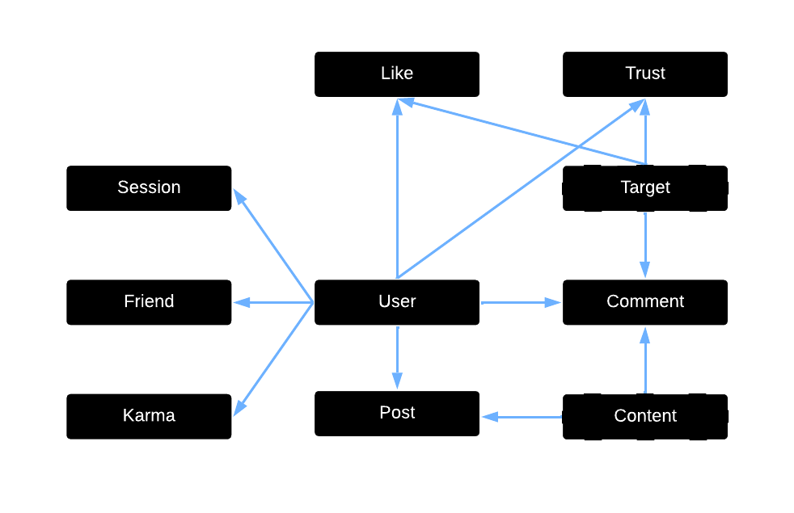

# Assignment 3: Convergent Design

## Pitch
The internet is full of so much information, but along with that information comes a tsunami of misinformation. RealTalk is a social media app meant for those who are tired of reading misinformation on the internet. By prioritizing the sharing of true information, we hope to reduce the spread of misinformation and making the internet a better place to learn. To do this, we give users the option of trusting or mistrusting posts and comments and apply a karma score to users depending on how trustworthy they are. When choosing which posts we show to users, we consider both the trust score of the post and the karma of the original poster. 

## Functional Design

### Concepts

#### User

User State Machine
  

>**concept** User
>
>**purpose** authenticate a partipicant of RealTalk
>
>**state**
>>registered: set User  
>>username, password: registered -> one String
>
>**actions**
>>register(n, p: String, out u: User)
>>>u not in registered  
>>>registered += u  
>>>u.username := n  
>>>u.passowrd := p  
>
>>authenticate(n, p: String, out u: User)
>>>u in registered  
>>>u.username = n and u.password = p  
>
>**operational principle**
>>after a user registers with a username and password, they can authenticate with that same username and password  
>>after register(n, p, u), u in registered, u.username = n, u.password = p; authenticate(n, p, u') results in u = u'

#### Session

Session State Machine

>**concept** Session \[User]
>
>**purpose** authenticate users for an extended period of time
>
>**state**
>>active: set Session  
>>curUser: active -> one User
>
>**actions**
>>start(u: User, out s: Session)
>>>s not in active  
>>>active += s  
>>>s.curUser = u
>
>>end(s: Session)
>>>s in active  
>>>active -= s
>
>>getUser(s: Session, out u: User)
>>>s in active  
>>>u := s.curUser
>
>**operational principle**
>>after a session starts until it ends, getUser returns the same user that started the session  
>>after start(u, s) until end(s, u), getUser(s, u') results in u = u'

#### Friend

Friend State Machine
  

>**concept** Friend \[User]
>
>**purpose** increase connections between others
>
>**state**
>>friends: User -> set User
>
>**actions**
>>friend(u1, u2: User)
>>>u1.friends += u2  
>>>u2.friends += u1  
>
>>unfriend(u1, u2: User)
>>>when u2 in u1.friends  
>>>u1.friends -= u2  
>>>when u1 in u2.friends  
>>>u2.friends -= u1  
>
>>areFriends(u1, u2: User, out b: Boolean)
>>>when u2 in u1.friends or u1 in u2.friends  
>>>b := True  
>>>otherwise  
>>>b := False  
>
>**operational principle**
>>after friend(u1, u2) until unfriend(u1, u2), u2 in u1.friends and u1 in u2.friends 

#### Post

Post State Machine
  

>**concept** Post \[User, Content]
>
>**purpose** share content with others
>
>**state**
>>posts: User -> set Post  
>>content: Post -> one Content  
>>author: Post -> one User  
>
>**actions**
>>post(u: User, c: Content, out p: Post)
>>>p.content := c  
>>>p.author := u  
>>>u.posts += p  
>  
>>unpost(u: User, p: Post)
>>>when p in u.posts
>>>u.posts -= p  
>>>forget content of p  
>>>forget author of p  
>
>**operational principle**
>>after post(u, p, c) until unpost(u, p), p in u.posts, u = p.author, and c = p.content

#### Comment

Comment State Machine
  

>**concept** Comment \[Target, User, Content]
>
>**purpose** react to other content
>
>**state**
>>comments: Target -> set Content  
>>author: Content -> one User  
>
>**actions**
>>comment(t: Target, u: User, c: Content)  
>>>t.comments += c  
>>>store u as author c is from  
>  
>>uncomment(t: Target, u: User, c: Content)  
>>>when the author of c is u  
>>>t.comments -= c  
>>>forget author of c  
>
>**operational principle**
>>after comment(t, u, c) until uncomment(u, c), c in t.comments and u is author of c

#### Like

Like State Machine
  

>**concept** Like \[Target, User]
>
>**purpose** show approval or disapproval of information
>
>**state**
>>likes, dislikes: Target -> set User  
>
>**actions**
>>like(t: Target, u: User)  
>>>t.likes += u  
>  
>>dislike(t: Target, u: User)  
>>>t.dislikes += u  
>  
>>neutralize(t: Target, u: User)
>>>when u in t.likes  
>>>t.likes -= u  
>>>when u in t.dislikes  
>>>t.dislikes -= u  
>
>**operational principle**
>>after like(t, u) until dislike(t, u) or neutralize(t, u), u in t.likes  
>>after dislike(t, u) until like(t, u) or neutralize(t, u), u in t.dislikes

#### Trust

Trust State Machine
  

>**concept** Trust \[Target, User]
>
>**purpose** show agreement or disagreement with the truthfulness of information
>
>**state**
>>trusts, mistrusts: Target -> set User  
>
>**actions**
>>trust(t: Target, u: User)  
>>>t.trusts += u  
>  
>>mistrust(t: Target, u: User)  
>>>t.mistrusts += u  
>  
>>neutralize(t: Target, u: User)
>>>when u in t.trusts  
>>>t.trusts -= u  
>>>when u in t.mistrusts  
>>>t.mistrusts -= u  
>
>**operational principle**
>>after trust(t, u) until mistrust(t, u) or neutralize(t, u), u in t.trusts  
>>after mistrust(t, u) until trust(t, u) or neutralize(t, u), u in t.mistrusts

#### Karma

Karma State Machine
  

>**concept** Karma \[User]
>
>**purpose** show how truthful a user is
>
>**state**
>>karma: User -> one Integer
>
>**actions**
>>increase(u: User)
>>>when u in karma  
>>>u.karma := u.karma + 1  
>>>when u not in karma  
>>>u.karma := 1  
>
>>decrease(u: User)
>>>when u in karma  
>>>u.karma := u.karma - 1  
>>>when u not in karma  
>>>u.karma := -1  
>
>**operational principle**
>>after increase(u) until increase(u) or decrease(u), u.karma is 1 more than before  
>>after decrease(u) until increase(u) or decrease(u), u.karma is 1 less than before

### Synchronizations

#### UserSession

UserSession Sync State Machine
  

>**concept** UserSession
>>include User  
>>include Session \[User.User]
>
>>sync register(username, password: String, out user: User)
>>>User.register(username, password, user)
>
>>sync login(username, password: String, out user: User, out s: Session)
>>>when User.authenticate(username, password, user)  
>>>Session.start(user, s)
>
>>sync authenticate(s: Session, u: User)
>>>Session.getUser(s, u)
>
>>sync logout(s: Session)
>>>Session.end(s)

#### UserReact

UserReact Sync State Machine
  

>**concept** UserReact
>>include User  
>>include Target  
>>include Like \[Target.Target, User.User]  
>>include Trust \[Target.Target, User.User]  
>>include Karma \[User.User]
>
>>sync like(u: User, t: Target)
>>>Like.neutralize(t, u)  
>>>Like.like(t, u)
>
>>sync dislike(u: User, t: Target)
>>>Like.neutralize(t, u)  
>>>Like.dislike(t, u)
>
>>sync neutralLike(u: User, t: Target)
>>>Like.neutralize(t, u)
>
>>sync trust(u1, u2: User, t: Target)
>>>Trust.neutralize(t, u1)  
>>>Trust.trust(t, u1)  
>>>Karma.increase(u2)
>
>>sync mistrust(u1, u2: User, t: Target)
>>>Trust.neutralize(t, u1)  
>>>Trust.mistrust(t, u1)  
>>>Karma.decrease(u2)
>
>>sync neutralTrust(u1, u2: User, t: Target)
>>>Trust.neutralize(t, u1)  
>>>when u1 is removed from Trust.trusts  
>>>Karma.decrease(u2)  
>>>when u1 is removed from Trust.mistrusts  
>>>Karma.increase(u2)

#### UserComment

UserComment Sync State Machine
  

>**concept** UserReact
>>include User  
>>include Target  
>>include Content  
>>include Comment \[Target.Target, User.User, Content.Content]  
>
>>sync comment(u: User, t: Target, c: Content)
>>>Comment.comment(t, u, c)
>
>>sync uncomment(u: User, t: Target, c: Content)
>>>Comment.uncomment(t, u, c)

#### UserProfile

UserProfile Sync State Machine
  

>**concept** UserProfile  
>include User  
>include Content  
>include Post  \[User.User, Content.Content]  
>include Friend \[User.User]  
>
>>sync friend(u1, u2: User)
>>>Friend.friend(u1, u2)
>
>>sync unfriend(u1, u2: User)
>>>Friend.unfriend(u1, u2)
>
>>sync areFriends(u1, u2: User, out b: Boolean)
>>>Friend.areFriends(u1, u2, b)
>
>>sync makePost(u: User, c: Content, out p: Post)
>>>Post.post(u, c, p)
>
>>sync deletePost(u: User, p: Post)
>>>Post.unpost(u, p)

### Dependency Diagram

Solid outline shapes are specific concepts. Dashed outline shapes are generic concepts.

## Wireframe

## Design Tradeoffs

1.  
    **a.** Like System  
    **b.** Likes vs. likes and dislikes  
    **c.** A system with only likes can only really gauge the positive reactions to a post or comment, not the negative ones. We can approximate the dislikes by subtracting the likes from the views and multiplying by some constant, but any constant that we use would give terrible results for some kinds of posts or comments. With dislikes, the algorithm can accurately gauge the relative strength of negative feelings towards a post or comment.
2.  
    **a.** Post Creation Options  
    **b.** Only registered users can create posts vs anonymous users can create posts  
    **c.** The main design of RealTalk is to push true information and to reduce misinformation. If anonymous users could make posts, they would be able to post large amounts of misinformation without their account getting flagged or pushed down in the algorithm, as they have no account.
3.  
    **a.** Where Likes/Dislikes and Trusts/Mistrusts Can Be Applied
    **b.** Only posts vs posts and comments
    **c.** To ensure that as much misinformation is removed as possible, comments should also be subject to the same community-based trust/mistrust system that posts have. If a comment is sufficiently deemed mistrustful, it can be hidden to further reduce misinformation.