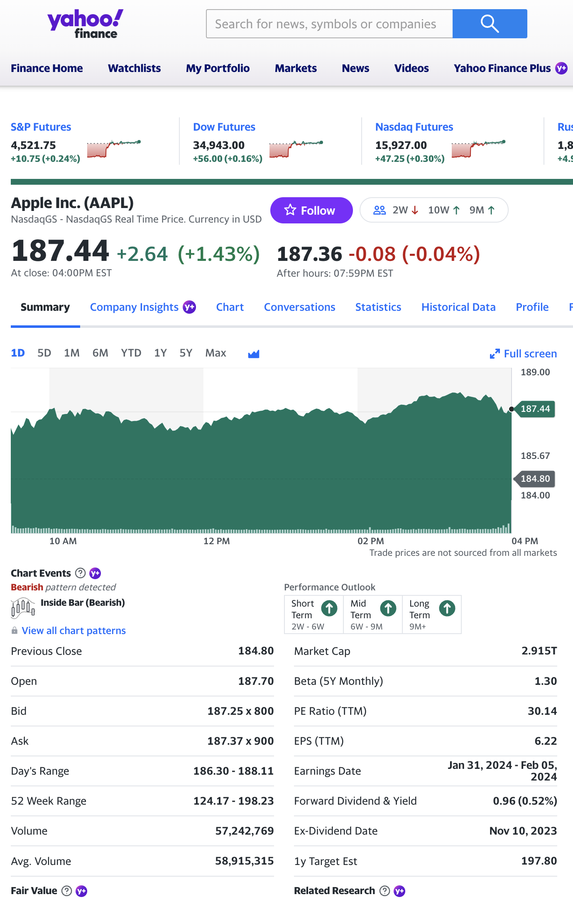
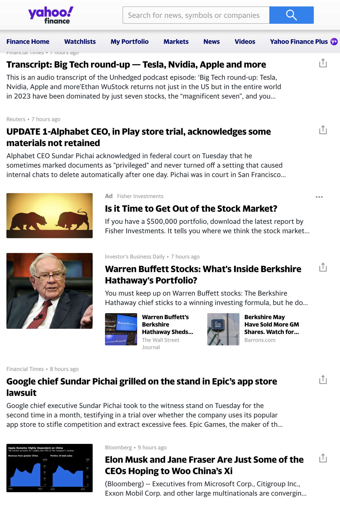
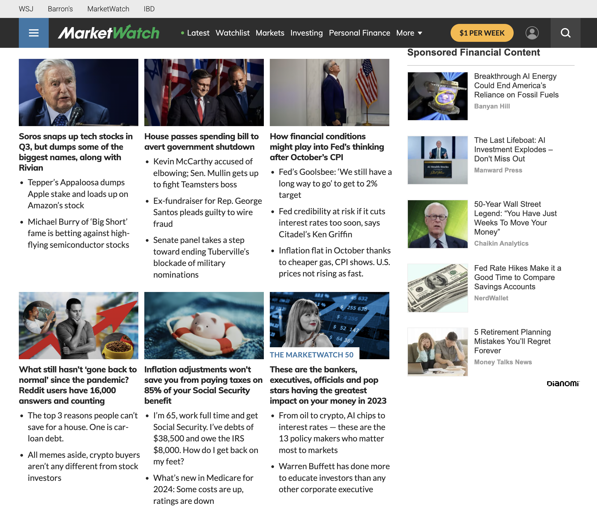
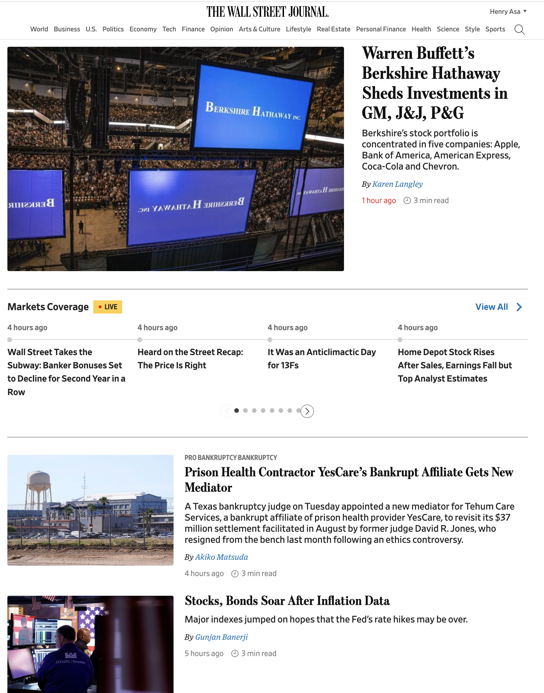
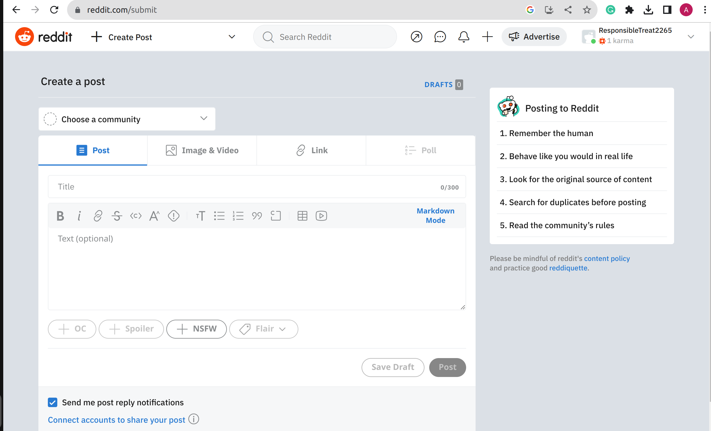
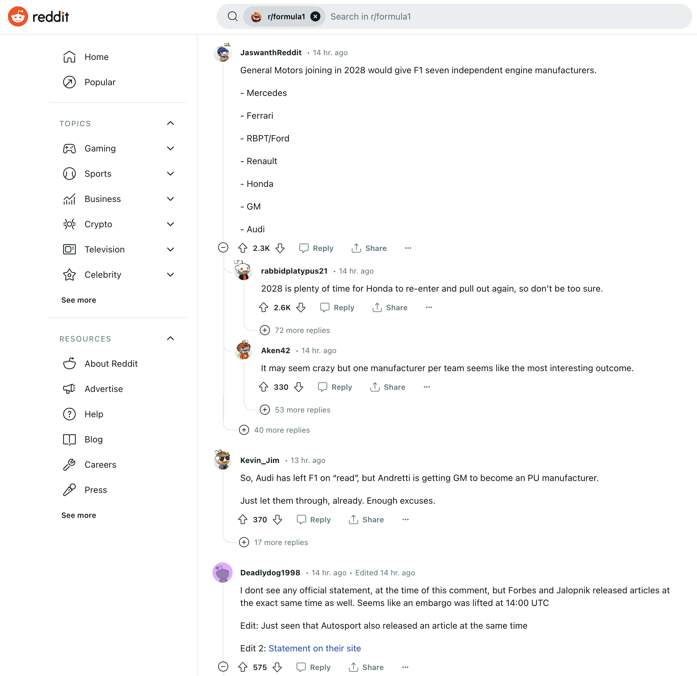
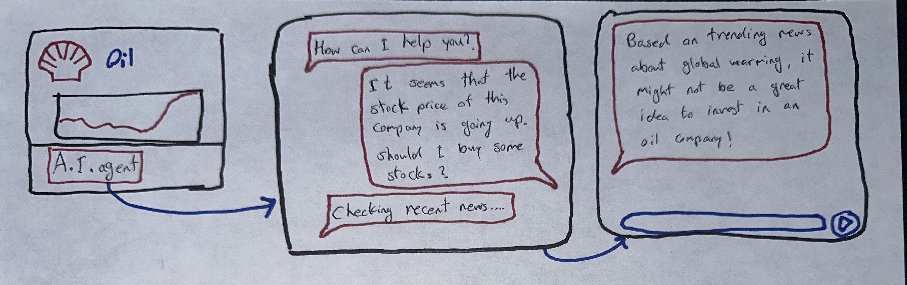
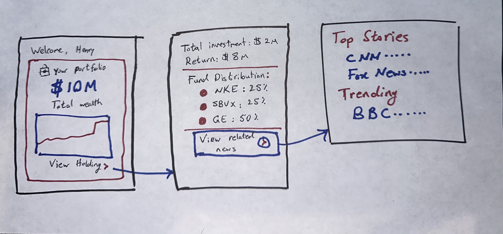
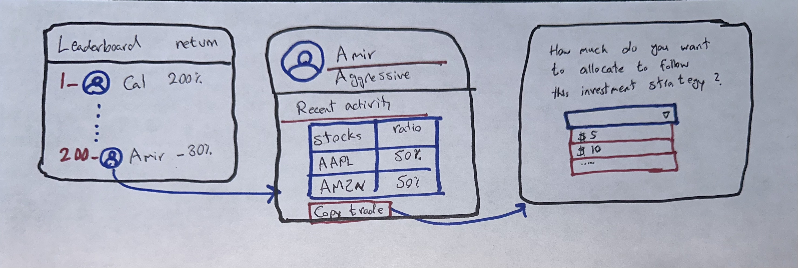

# Project Phase 2

## Team Contacts

Team Email: [61040-project@mit.edu](mailto:61040-project@mit.edu)

### Team Members

| Name             | Email                                       | GitHub                                             |
| ---------------- | ------------------------------------------- | -------------------------------------------------- |
| Henry Asa        | [henryasa@mit.edu](mailto:henryasa@mit.edu) | [@HenryAsa](https://github.com/HenryAsa)           |
| Amir Kazeminia   | [amirka@mit.edu](mailto:amirka@mit.edu)     | [@amirika20](https://github.com/amirika20)         |
| Cal Wilson       | [calwilsn@mit.edu](mailto:calwilsn@mit.edu) | [@calwilsn](https://github.com/calwilsn)           |
| Jonatan Fontanez | [jonfon01@mit.edu](mailto:jonfon01@mit.edu) | [@DragonStorm25](https://github.com/DragonStorm25) |

### Team Project Mentors

| Name                | Email                                       |
| ------------------- | ------------------------------------------- |
| Ashley Granquist    | [ashleymg@mit.edu](mailto:ashleymg@mit.edu) |
| Fabrizzio Orderique | [porderiq@mit.edu](mailto:porderiq@mit.edu) |

## Application Summary - Sharefolio

> Invest exactly like Warren Buffett without being Warren Buffett.

Sharefolio is a community-powered asset trading platform.  Unlike other asset marketplaces, users are able to see other users' asset holdings and public leaderboards are used to rank users' trading/investment performance on the application.  With this data made public, users can make more informed decisions on what they want to invest in depending on their peer's actions and holdings.  Additionally, users can choose to `Copy-Invest` other users' portfolios, meaning that all trades a copied portfolio makes are automatically reflected in all copiers' portfolios.  This `Copy-Investing` feature allows users to "invest exactly like Warren Buffett, without being Warren Buffett."

::: warning Important Note About Privacy
Similar to how Venmo conceals the value of each transaction but publicizes the comment associated with a given transaction, users will be able to choose whether a particular transaction will be public or private.  Additionally, **all specific values** (for example, the amount of money a particular user invested in a certain asset) are always private.  Percentage distributions may be made public (depending on the user's discretion), but specific quantities are confidential.
:::

## Features

In this section, 24 features are outlined and detailed.

### `Portfolios`

`Portfolios` are essentially accounts that contain a certain amount of cash that a user has deposited into it and also contains a collection of assets (stocks) that the user has purchased.  Users can create multiple `Portfolios` and can deposit/withdraw cash from their `Portfolios`.  People would `Copy-Invest` other users' `Portfolios`.  Investment insights would be created for these portfolios and users would be able to view their holdings depending on the `Portfolio` they belong to.

### `Leaderboard` and Rankings

Sharefolio would have a `Leaderboard` of investors, ranking them based on how their portfolio performs over a given time period.  These `Leaderboards` could also be segmented into different categories/types of investors, or based on the industries a particular investor tends to specialize in.  For example, there could be a `Leaderboard` of tech stock traders, ETF traders, or energy traders.  This `Leaderboard` would be publicly viewable to all other users of the platform, and users can view ranked traders' holdings to inform their own trading decisions.

### `Copy-Trading` and `Copy-Investments`

A user would be able to `Copy-Trade` other users’ `Portfolios`/holdings.  Every trade a copied user makes would be automatically reflected in the copier’s portfolio as well.  This automatic synchronization of trades allows copiers to perform exactly the same as the users they “copy”.  When enrolling in the `Copy-Trade` functionality, the copier would designate the amount of money that they wish to mirror the other user's trades, and then Sharefolio would handle all of the automatic buying/selling synchronizations so that the two portfolios are equally weighted in their holdings.

### Friends' & Followers' Activity Feed

This activity feed would display the recent activity of users that a person follows or is friends with.  Recent stock purchases and sales, `Copy-Investment` enrollments or liquidations, and other relevant information of users that a person would be interested in hearing about would be presented on this page.  This feature is inspired by Venmo's main home page where friends' recent transactions are displayed.  Like Venmo, sensitive financial information (like the amount of money involved in the transaction) would be hidden, and users would be able to designate their transactions to be public or private.

### News Feed

For the companies that a user follows/is invested in, they would see a tailored news feed containing important (market-moving) articles that might be relevant to that company’s stock performance.  Using GPT, this news feed would be curated to show high-quality and relevant information that a user is more likely to be interested in for the companies/stocks that that user would be interested in.  For example, if our AI-powered user profiling tools determines that a user only invests in companies with very low [P/E ratios](https://www.schwab.com/learn/story/stock-analysis-using-pe-ratio), then articles discussing [P/E ratios](https://www.schwab.com/learn/story/stock-analysis-using-pe-ratio) would more likely be recommended, since this is a metric that the user cares to follow.  This is a relatively standard feature in stock trading platforms where articles related to companies a user is invested in are displayed first.

### Alerts and Notifications

Users can choose to set alerts for certain designated stocks/industries, and would be notified of any non-nominal behavior.  If price changes are much higher than usual, or trading volume is lower than usual, or volatility is unusually high, users can choose to be notified of these behaviors.  Similarly, users can choose to be alerted by the activities/trades of other users, and can be notified of other users' behaviors as well.  Users can customize alerts and notifications to receive only the most relevant information they desire.

### Relative Performance Tracking

Advanced and detailed performance metrics comparing a user's portfolio to all users’ portfolios would be computed and displayed in a presentable/digestible manner.  How a user ranks among their peers, among other users with similar investment strategies/styles, as well as insights into the stocks they are invested in would be displayed.  Time-varying metrics would also be included so that users can see how their relative performance improves/worsens over time, and why this is the case.

### AI Assistant

An AI-powered assistant would suggest investments based on a user’s portfolio, past trades, and could recommend diversification strategies to help to reduce financial risk of their holdings.  This assistant would be similar to a chatbot that is educated on the current news and is aware of the stock market's current behaviors.  Users could interact with the AI assistant to get stock advice, learn about similar stocks, and be recommend other users' profiles that they might want to consider `Copy-Investing`.  This could be similar to Snapchat's "My AI" feature.

### User Profiling and Characteristics

The User Profiling feature would involve a GPT-powered AI to review a user's stock holdings, investment/trading patterns, company preferences, and other behavioral characteristics to ultimately profile/characterize that user.  A set of quantitative and qualitative factors that describe the strategy of a user would be used.  For example, an "aggression factor" could be assigned to users quantifying how aggressive or conservative a particular trader is.  With these metrics, users can use this information to help decide whether or not they wish to `Copy-Trade` a different user, or could filter users based on certain profile characteristics (create a `Leaderboard` of only conservative traders, for example).

### Advanced Market Filtering

Users would be able to enter search terms to narrow-down their searches to only view companies that correspond to their specific and narrowed search filters.  Users would be able to search by companies' names, performance ranges, specific metrics (percentage gain over the past year for example), industry, and a multitude of other criteria.  This makes the researching process for more informative, as it enables users to identify companies that they might be interested in investing in depending on whether or not they meet their defined criteria.

### Community Groups and Forums

Users would be able to make new groups and post in those groups to share relevant information with each other, or simply socialize with like-minded traders.  They would be able to make new discussion topics and comment on these topics.  They could also join forums related to specific stocks, sectors, or the market as a whole.  This is a common concept seen in many platforms such as Reddit.  `Leaderboards` would exist in these groups so users can compare each other's performance with the specific members of that group.

### User Following

Users would be able to follow other traders.  After following another trader, they would be able to see that trader's activity directly in the user's [activity feed](#friends--followers-activity-feed).  This increased personalization allows users to more easily track the activity of those they wish to follow.

### Collaborative Trading

A group of users would be able to make a fund where their trades and actions are pooled together.  All "fund managers" would have control over the fund and would be able to buy and sell stocks.  There would also be a communication medium built into the fund to enable fund managers to communicate with each other directly in the app.

### Asset Charts

Asset charts would visualize the price history of stocks over a period of time.  Users would be able to choose whether to view only a single stock, or overlay multiple stocks onto the same chart.  Users can switch between [line charts](https://www.investopedia.com/terms/l/linechart.asp) and [candlestick charts](https://www.investopedia.com/trading/candlestick-charting-what-is-it/).

### Recurring Investments

Users can set up investments that occur on a periodic, set basis.  This would be similar to the recurring investments in Robinhood.

### Buying/Selling Assets

Needless to say, our investment platform would allow users to buy and sell assets.  Users can purchase stocks to add to their holdings (which deducts that amount of cash from their account) and sell stocks to remove them from their holdings (receiving the corresponding value of the stock sold).  In addition to stocks, users would be able to trade ETFs, Mutual Funds, cryptocurrencies, and other commonly traded assets that are often bought/sold on exchanges like TDAmeritrade and Robinhood.

### Trading Competitions

Users can join a competition to compete with other users to see who makes the highest returns in the allotted time period.  These competitions could use real or fake capital, and all users would starting the trading period with the same amount of money.  They compete to make the most profit in a set period of time, building skill through competition.  `Leaderboards` would highlight the performance of the highest returning traders.

### Virtual Trading Simulations (Paper Money)

Users would receive a set amount of capital and can experiment with this "paper money" to try to make profit over time.  This is intended to allow users to test different strategies that they might not be confident to try with real cash.  Ultimately, they would build skills and practice trading strategies without actual financial risk.  This differs from the [Educational Trading Competitions](#trading-competitions) feature as it is more private and allows users to test out different strategies in a non-public setting.

### Educational Stock Market Resources

Material will be available to users to educate them about basic trading practices, strategies, and risk management.  These would be written by industry experts and could be updated by other traders on the platform to include strategies that are more complex or that tend to yield higher returns.

### Verified Users

“Verify” users who are well-trusted in the community, granting them additional privileges and trustworthiness.  These verification badges could be designated to professional financial/investment advisors, celebreties, and other stars in the investment world.  Some users may only want to `Copy-Invest` users that are verified, as there is more risk associated with copying the investments of an unknown user.  With verification badges, a user would be associated with a level of trust that makes them more reliable.  This is a common feature used on many social media platforms.  However, in our app this would be especially valuable as users should be able to fully trust each other before taking investment advice from one another.

### [`Portfolio`](#portfolios) Statistics

This is a relatively standard feature for trading platforms.  Advanced and detailed metrics related to a user's `Portfolio` performance and holdings would be presented.  This could include a user's estimated [beta](https://www.investopedia.com/investing/beta-know-risk/), [standard deviation](https://www.investopedia.com/ask/answers/021915/how-standard-deviation-used-determine-risk.asp), or [Sharpe Ratio](https://www.investopedia.com/terms/s/sharperatio.asp) (among other metrics).  This would allow users to more easily assess how much volatility their `Portfolio` is exposed to.  These are generally well-known statistics that are readily available on some advanced investment platforms but not as accessible on others.

### Holding and [Portfolio](#portfolios) Notes

Users can write notes providing explanations for each stock in their `Portfolio`.  This would allow them to share insights about why they like or dislike certain stocks which could encourage discussion with other users and help inform other users' decisions.  This would provide value to a user’s followers by potentially learning from the explanations.  This would also provide value to the user who adds the explanations, as they may be challenged on their viewpoints.

### [`Portfolio`](#portfolios) Themes

Each `Portfolio` can be marked with a theme such as Tech, Energy, Healthcare, Biotech, etc.  These themes could be identified/suggested by GPT's analysis of the `Portfolio's` holdings, or manually/directly by the user.  This makes it easier for people to copy-invest in an area that they are passionate about or a sector that they believe has promising future growth.

### Reporting

Users would be able to report others which prompts a further investigation from app administrators.  If enough users report someone, or if a verified user reports someone, their account will be suspended until it is reviewed.  This is an effort to prevent scams or suspicious behavior from taking place before people are harmed.

## Concept Outlines

| Concept Name | Purpose | Operational Principle |
| ------------ | ------- | --------------------- |
| Asset | To track the current price, history, and statistics associated with an asset or share of a company. | Purchasing an asset $s$ signifies ownership of one share of a company $c$ in sector $z$, its current and historical price $p$, beta $\beta$, and other statistics about the stock may be viewed.  The price at the time they bought the stock, $x$, will also be used to track relative price changes. |
| `Portfolio`[Asset] | `Portfolios` are a collection of stocks that make it easy to organize, track, and manage a collection of assets. | After adding a collection of assets $s$, to their portfolio, their combined variance $v$, Sharpe ratio $S$, and other statistics may be viewed |
| Friend[User] | To allow for a connection between users. | After a user $u$ befriends another user $u'$, they may gain special permissions to view each hidden attributes about one another. |
| Money | A medium that simplifies transactions, serves as a measure of value, stores wealth. | Some amount of money $m$ is deposited on the app, which may be used for some actions within the app before some quantity of money $m'$ is later withdrawn. |
| `Leaderboard`[`Portfolio`] | To rank users based on a defined factor that describes their performance in trading. | A collection of users' `Portfolios` $p$ may be sorted by some underlying metric to rank their performance in sorted order in `Leaderboard` $l$. |
| Article | To inform users about the news, recent trends, or developments in the market or related topics. | Each article $a$ provides a set of tools including filtering, adding to the favorite, and summarization to analyze the text $t$ of that article. |
| NewsFeed[Article] | Presents a collection of articles to the user that are relevant to that users' interests, asset holdings, and preferences. | A collection of related articles $a$ are collected into a single NewsFeed $n$. |
| [AI Assistant](#ai-assistant) | A tool to help users assess their assumptions with the current news and help inform their trading decisions referencing current news about the market. | After some text $q$ containing a question or comment about a company or portfolio is used to prompt the AI Assistant $A$, the AI Assistant would use recent market trends and its training data to output some text $t$ to assess the validity of the users' comment, answer any questions, or correct any false assumptions that might have been made in the original message. |

## Scrapbook of Comparable Features/Ideas

### Leaderboard

 

#### [The International Chess Federation's Leaderboard](https://ratings.fide.com/)

Leaderboards similar to the Chess Federation's example below could be used to display user's trading performance over a set period of time.  Depending on the context in view, these leaderboards could rank different attributes.

### Stock Pages and Snapshots

 

#### [Yahoo Finance](https://finance.yahoo.com/quote/AAPL?p=AAPL&.tsrc=fin-srch)

Simple graphs with high contrast.  Details an asset's key characteristics as well as a chart highlighting its performance of a variety of different time ranges.

### News Feed

Shows related news, potentially match specific stock to specific news articles.  Split either top-bottom or left-right, depending on how prevalent we want to make the news.  Very important to add how old the article is so users can make an accurate judgement using more recent information.

#### [Yahoo Finance](https://finance.yahoo.com/quote/AAPL?p=AAPL&.tsrc=fin-srch)

Below stock charts, Yahoo Finance includes relevant articles to the company currently being viewed.

#### [Marketwatch](https://www.marketwatch.com/)

Like Yahoo Finance, Marketwatch includes finance-specific articles, with a banner highlighting the top headlines of the minute.  In Sharefolio, these articles could be tailored to the specific preferences of a user.

#### [WSJ Finance](https://www.wsj.com/finance)

This illustrates another example of a potential newsfeed, this time coming from an established newspaper.

### Groups & Forums

Groups and Forums could be created to allow more tightly-knit communities to emerge.  Like Reddit, these groups can focus on different subjects, set different themes for themselves, and be public/private.  `Leaderboards` would be included within the Group to highlight the performance of members in the group.

#### [Reddit Post Creation](https://www.reddit.com/)

This image highlights how a post might be created on our platform.

#### [Reddit Communities (Sub-Reddits)](https://www.reddit.com/search/?q=mit&type=sr&cId=36f937fd-1c51-4757-bc51-2c931f5314e2&iId=43c5ebcd-4d4c-4f1d-ad6e-794538ac4937)

There are a variety of communities/groups that could flourish on Sharefolio, being connected by topics ranging from investment styles/strategies to regional geographic groups.

#### [Reddit Conversation](https://www.reddit.com/r/formula1/comments/17v2u4t/cadillac_to_enter_formula_1_as_seventh_power_unit/)

This kind of discourse, where users are able to respond to each other with detailed comments and then up/down-vote those responses to gauge the general "communal response" to a particular post, can be an incredible resource for traders looking to get feedback on their investments, strategies, or plans.  This form of public feedback on a stock pick can lead to more informed and thought-out investment decisions.

### Verified Users

This image is from Twitter, showing that Elon Musk’s account is verified.  Potentially, we could use a checkmark sign to show that a user has been verified since they have submitted some government identification.

#### [Twitter (X)](https://twitter.com/)

## Storyboard

### AI Agent

On our platform, there will be an AI agent icon on every page so that users can share their ideas and receive feedback/advice regarding their investment plans.  We plan to use a news-consolidating version of GPT in order to search and find related news to the stocks that a user has.

### Portfolio

Each user will have multiple `Portfolios` containing a number of different assets that they can choose to allocate.  When viewing these assets, a user can view related articles and other information about that asset that would be relevant to them.

### Leaderboards

Through the leaderboard, users can view other traders’ portfolios and `Copy-Trade` them.  Users would designate a particular quantity of money to be `Copy-Invested`, and then that money would automatically reflect the positions/holdings of the `Portfolio` it is mirroring.

